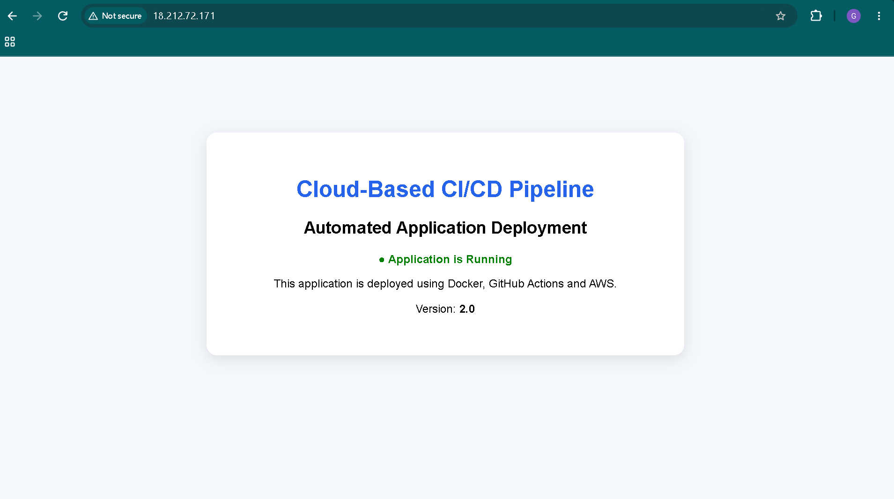
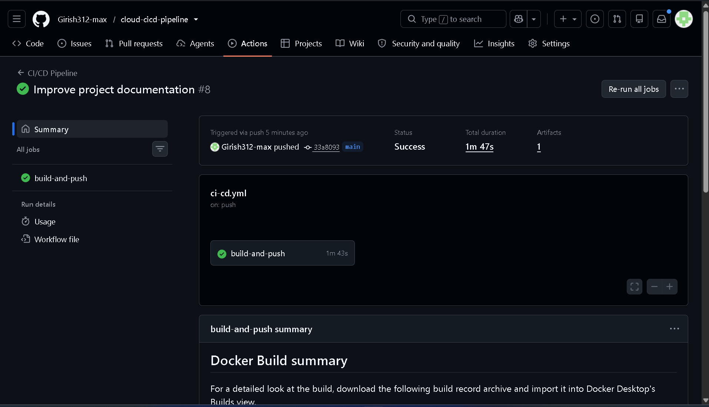
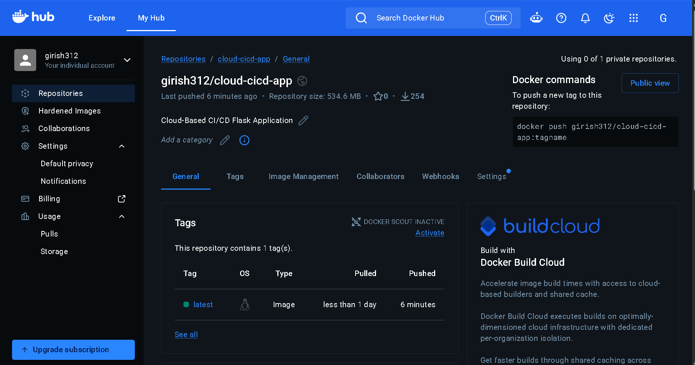
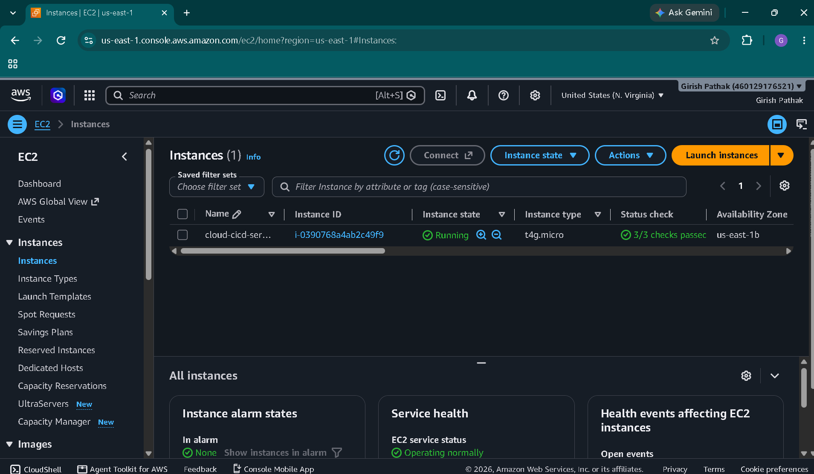
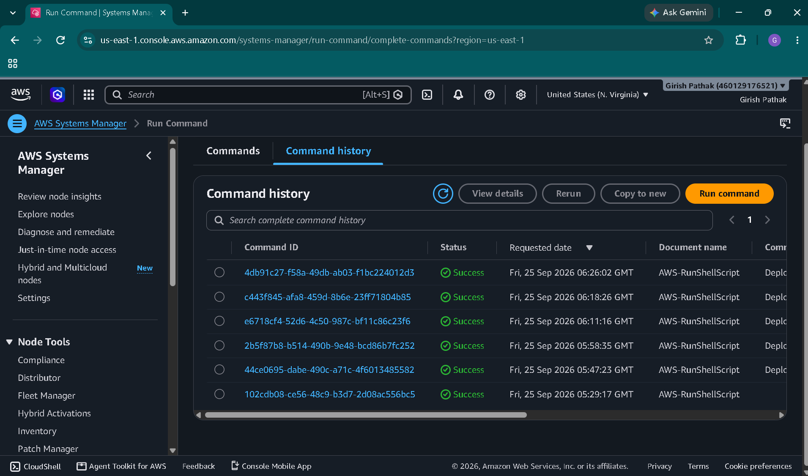

# 📸 Project Screenshots

## 🌐 Live Application

The Flask application is successfully deployed and accessible through the AWS EC2 instance.

---

## ⚙️ GitHub Actions CI/CD Pipeline

GitHub Actions automatically runs the testing, Docker build, Docker Hub push, AWS authentication, and EC2 deployment stages.

---

## 🐳 Docker Hub

The ARM64 Docker image is published to the project's Docker Hub repository.

---

## ☁️ Amazon EC2

The Flask application is deployed inside a Docker container running on an Amazon EC2 instance.

---

## 🔄 AWS Systems Manager

AWS Systems Manager is used to execute the deployment commands on the EC2 instance without requiring GitHub Actions to directly connect through SSH.

